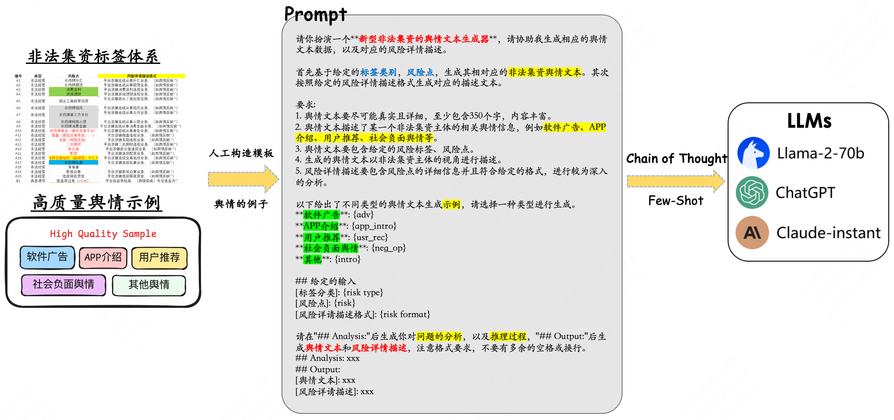

<div align='center'></div>

# [TaoTie]: Open-Source Dataset for New Types of Illegal Fundraising

## Overview

This repository is dedicated to generating data on new types of illegal fundraising activities, aimed at helping researchers and developers better understand and combat these issues.

## Process

### Step 1: Data Collection

We have scraped initial texts concerning various companies' public sentiment from major platforms.

### Step 2: Data Cleaning

- **Deduplication**: Removal of duplicate texts.
- **Quality Assessment**: Texts with content greater than 200 characters are considered valid.
- **Effective Selection**: We selected texts related to illegal fundraising.

### Step 3: Quality Evaluation

We are considering incorporating GPT-4 for further quality evaluation in future iterations.

### Step 4: Data Selection

We identified and selected valid texts related to illegal fundraising.

### Step 5: Manual Classification

We manually classified 18 high-quality examples into the following five categories:

1. Software Advertisements

   ```txt
    最新项目、新机遇～
    最简单最耀眼的商业模式：
    上海巨指集团打造全球最大的财富消费平台～众植园，8月1日正式开园，结合了摸金派、巨氧超宝，消费返利、资产证券复利滚存、农场游戏、线下实体商户对接等多模式为一体的平台！
    收获：从第三方交易平台购买金粒1号转到众植园积分商城易物消费并播种，赠送3倍的种子，平均分为36块土地，每10天自然成熟一块土地，收获的金豆交粮之后80%变成金粒一号，随时可转到百币网上变现，也可直接重新用于播种！
    加速：
    邀请朋友施肥加速10%，小部落灌溉加速9%，邀请你的朋友注册众植园并播种，就是帮你施肥，可以快速让你的土地快速成熟！你直接邀请的朋友就是你的部落，建立两个以上部落之后，你的小部落所有小伙伴的播种都是在帮你灌溉，让你的土地快速成熟，但是灌溉成熟的土地，每天封顶最多只能成熟三块！
    集团拥有：基金、保险、文交所、网络游戏、虚拟资产，国家PPP牌照，旗下8家子公司。
    现在我们巨指集团与央企瑞宝国际合作，瑞宝巨指将共同打造全球最大的消费财富平台！
    我们的平台，有自己的聊天工具，有自己的聊天好友，有自己的游戏农场，有自己的积分商城，有自己的商户，有自己的保险，有自己的农业……
   ```

2. APP Introductions

    ```txt
    洋老板商城app安卓版是一款非常不错的全球购物软件，洋老板商城为你带来了全球各地的正品好货，用户随时都能在线进行采购，欢迎大家下载使用哦！洋老板商城app简介：洋老板商城是IBA爱彼家集团旗下的全球消费平台，只卖全球的优质正品，强势的海外买手团队精心挑选来自全球的超人气大牌、超值商品，IBA 100%正品保证，海外直邮。数十个国家馆让你逛个爽，还有每周上新，限时秒杀，各种惊喜活动上不停，让你无忧买遍全球！同时，这里还是全球的生意平台，让每个人都可以无忧做洋老板！轻松加入洋老板合伙人，拥有自己专属的推广海报与二维码，推荐并卖出商品或自己消费，均可获得返利，让你无忧做全球生意！洋老板商城app特色：全球货源全球买卖 购物无忧产地直采源头把关 品质监督正品保证100%保证 海外正品快速清关发货极速发货 全球必达【联系我们】 1.官方网站：www.yanglaoban.com; 2.客服电话：400-883-1959； 3.官方微信公众号：洋老板跨境购； 4.官方微博：洋老板全球购。相关新闻在洋老板商城“纷享会”活动期间，消费者自行购买活动专区进口商品，可获得商品价格10%-30%的奖励；如果觉得商品满意，可一键分享给好友购买，好友购买并确认收货后，分享者也可获得最高30%的奖励，购物消费的同时还能赚钱盈利，快带上好友一起行动吧！版本记录2022-02-22 版本: 5.5.2优化UI样式，提高用户体验2021-10-08版本: 5.4.1优化UI样式，提高用户体验2020-11-04版本: 4.1.1双11千元红包到账~11月4日狂欢开启！
   ```

3. Other User Recommendations

    ```txt
    拼拼有礼，优米心选后，我继续上车To拼商城，感慨万千。
    自从6月份左右接触到了第一个拼团的项目拼拼有礼，说实话刚开始我是没打算玩的，我一直认为这个东西就是假的，就是资金盘，就是来收割我们这群韭菜的。因为我本人玩点股票之类的东西，所以感觉入门也才2000多块钱，然后我就上车了，没想到的是确实能挣钱，确实能赚钱，并且那些有资源的人能迅速的推广起来，这个玩拼团项目就是推广才是最赚钱的，一天赚大几千的多的是，我算是一个小玩家吧，毕竟也不认识多少人，自己搞2个号玩了拼拼有礼，然后玩了2个月不到吧，2个号5000 多一点的本，赚了4000多左右，收益率一算还是挺高的哦，2个月都快回本了。
    玩到大概8月份的时候，正好拉我玩拼拼的朋友要我去玩一个新的拼团项目，优米心选开始了，因为玩了拼拼有礼后我个人的感受还是不错的，这次呢就准备多上点号，因为我自己推广没什么人，想了想自己多玩点号得了，本金1560，一天大概可以赚40元，一算月收益率高达75%，然后我朋友说放心玩，因为这个项目有大团队过来，都考察了很多遍了，我自己想了想然后就玩了6个号，自己也推了几个人，玩到现在都有40天了，我算了算现在不玩大概赚了1w多点了。                                                                                         玩优米的过程中听说拼拼有礼崩盘了，此时我的心中还有一些后怕，不了解的情况下就上了拼拼有礼的车，我现在去查了一下拼拼有礼是4月份出来的，到8月已经有4个多月了，我幸亏遇到了优米，要不然就被坑了，所以玩拼团的这种项目一定要玩最开始的，风险就很小很小了。                                     优米因为9.19要开发布会，再加上上市公司控股，所以基本上优米还可以玩2个月的，到时候得提前撤掉。
    到了今天，我的好朋友又带给了我一个新拼团的项目，To拼商城。其实这些拼团项目很多很多，为什么我会玩这些项目，有4点。
    1.有大团队入场，都是几万人几十万人的。
    2.公司资金雄厚，有实力雄厚的投资方.
    3.身边大部分的人都在玩，且没有问题.
    4.一定要早点玩。

    我玩了这几个项目都是赚钱的，都没崩盘，原因在于一定要早玩（你们看拼拼假如4月玩一样赚钱），优米就不说了可能还有很久，To商城因为本金小，刚开，可能和以前的唐古拉一样存在很长时间（唐古拉现在还在玩，都快1年了），我们玩这个一定要稳，保住本金的情况下去赚我们该赚的钱，这才是最重要的，只要玩的早，公司稳，大团队入驻，你不是很贪心，你就一定能赚钱，赚多赚少的问题罢了，不会推广的赚小钱，会推广的赚大钱，我那个朋友优米现在一天大几千，To现在刚开始2天就上千了，赚钱其实很简单，关键在于你找对路了吗？
    To商城是有大团队入驻的，大团长还去考察过。所以我上车了，冲就完了，对于一个新开的拼团软件，并且有大团队入驻考察的，你值得拥有。不管你是一个号玩搙点羊毛，还是你有资源会推广的都可以来找我，一起赚钱，一起发财。猪站在风口上，都会被吹飞，此时21年的风口就在拼团上，还不快来吗？让我们一起知行合一！！！
   ```

4. Social Negative Sentiments

    ```txt
    一电商平台再现“阳光下的罪恶”，引得不少人上当受骗……
    2019年8月，一款被称为“种草达人的欢乐场”的电商平台寻草记悄然上线，在这个已被淘宝、拼多多“占领”的电商市场，寻草记却号称以“在寻草记，你想要的，都可以申请0成本入手”迅速夺取大众的视线。
    据悉，寻草记的初期目标是：到2025年帮助1亿消费者实现消费自由。那他们是怎么做的呢？寻草记唯一的要求，就是你在它的商城买一件东西时，先要支付给平台差不多100倍的订金，然后平台在一定时间将钱全部退还给你。比如说，你要在“寻草记”商城买一个334元的运动椅，需要先付给平台33400元，然后平台最短半个月将33400元全部返给你，等同于自己免费拿到了334元的商品。
    这段话给人的第一感觉就是个骗局，但信息显示，寻草记的实控方是新三板挂牌公司——北京九天云竹信息技术股份公司，实力股东有上海证券、东方财富证券、华金证券、联储证券、华信证券、东莞证券、中盛基金、小微互联投资、火烧云投资等，这些机构最不缺的就是钱。
    于是，大家纷纷前往寻草记购物，只为“捞一大笔”，感觉天上掉馅饼的事终于成真了。但是，众多周知，天上永远不会掉馅饼，只有陷阱。
    2020年6月，有人在“寻草记”商城以八折价格拍下五笔话费（涉及900元）充值，卖家却逾半月不发货。用户再次要求发货时，客服说要等领导，等了半个月，客服说该用户拍的价格不公平（这是平台自己挂的价格），还威胁说要走法律途径，退款当然更是无从提起。2021年1月开始，大量提现困难的事件不断发生。2月1日，很多会员在多方求证后发现：平台已经无法提现了！平台客服解释说，受平台升级影响，提现会延迟到账，请耐心等待几日。两天后，平台爆出内部员工上百万资金无法提现，部分员工去找实控人讨要说法的消息。
    2月5日，部分受害者前往“寻草记”商城方北京维引力文化传播有限公司北京办公地点，而“寻草记”成都办公地点，已经在短短几天内人去楼空。
    公然上演“阳光下的罪恶”的寻草记，其品牌域名又是如何呢？
    寻草记，官网启用的域名是xuncaoji.net。查询发现，寻草记APP于2019年8月上线，而xuncaoji.net注册于同年4月，提早收购与品牌契合的域名，可见寻草记的品牌域名保护意识较高。主体“xuncaoji”与品牌名高度契合，且字符不算太长，用户在理解与记忆方面都没有困难。
    目前，xuncaoji.net正被北京维引力文化传播股份有限公司持有保护，同主体的xuncaoji.com/com.cn均被注册，但都不属于该公司旗下。值得注意的是，xuncaoji.cn尚未被注册，对域名有所研究的米农们都清楚，.cn后缀域名是中国国家顶级域名，是全球唯一由中国管理的英文国际顶级域名，通用性仅次于.com后缀。寻草记不顾xuncaoji.cn却选择了xuncaoji.net，其背后的原因我们不得而知。而如今寻草记也已停止运营，未来该枚域名会“花落谁家”，我们拭目以待。
   ```

5. Other Public Sentiments

    ```txt
    随着我国老年人口数量的不断增加，中国人口老龄化问题已日渐凸显，国家社会养老金不足、养老金缺口大也成为不争的事实。如何更好地为老百姓提供养老的保障，激活中国庞大的消费群体，让人们敢花钱、愿花钱，从而发动消费经济的引擎成为目前中国的当务之急。在这样的大背景下，一边花钱就能一边养老的“小确幸消费养老”模式应运而生。据了解，“小确幸消费养老”这种模式是在不增加国家、社会、个人负担的基础上，不仅提升了社会保障，而且注入了“一生消费，一生养老”的理念，让消费者更愿意消费，从而达到了持久推动社会经济发展的目的。
    很多人疑问积攒到小确幸APP养老金账户里的钱从何而来?小确幸通过与日常生活消费中多个领域的商家签订协议，为商家提供促销推广平台和会员增值服务平台，在保证实现商家薄利多销的前提下，商家需拿出一定比例的利润返还额，而这些钱就会被直接存入用户的账户中，成为用户的消费养老金。
    “以往市民是一张会员卡只能在一个商场里消费使用，积攒指定金额后，可享受折扣或者某种服务。现在市民持小确幸APP，即可在衣食住行吃喝玩乐等多个领域的几万家商店内使用，通过商家返利实现对未来养老金的堆积。”北京新德浓信息技术有限公司创始人余汶龙介绍。
    一袋盐、一顿餐所积攒的消费积分有望成为你未来的养老金，这并不是一个故事，而是一个新兴的养老模式，小确幸APP的出现即为中国养老事业的发展提出新的观点。该观点认为，将消费资本参与企业利润分配后的部分收益转化为养老资本，从而将消费与养老进行有机结合，实现人人都可参与养老资本积累的新养老模式。这种新的经营模式不仅给消费者带来了切身的利益，也将给社会带来了巨大的公益性效应。
   ```

These classified examples will serve as references for subsequent large model-based data generation.

### Step 6: Data Generation

To generate realistic public sentiment texts:

- **Role Play**: We instruct the model to act as a **[public sentiment text generator]**.
- **Few-shot Learning**: We provide several examples of the five categories in prompt instructions.
- **Chain of Thought**: We guide the model to analyze and reason about the task before generating the final result.

This sequence aims to produce logically consistent and well-structured outputs.

### Step 7: Data Synthesis

Finally, using the labels, risk points, and samples from the high-quality examples, we synthesize data by leveraging GPT-4's capabilities.

## Visual Workflow

Below is the visual representation of the initial data selection process. This diagram illustrates how we scrape, clean, and classify the public sentiment texts related to illegal fundraising.


This diagram showcases the data synthesis workflow. It highlights how we use few-shot learning, role play, and chain of thought methods to guide the model in generating realistic public sentiment texts, and how we leverage GPT-4 to synthesize the final data.



## Data Generation Results

The following section presents an example of the results generated by our data synthesis process. This example illustrates how we identify and categorize risks associated with illegal fundraising activities, using the methods and workflows described earlier.


```json
{
    "id": "A13",
    "risk_type": "非法经营",
    "risk": "二元期权",
    "risk_format": "平台涉嫌二元期权违规业务，（如舆情反映“”）",
    "risk_text": "聚金汇APP是一款最新推出的投资理财平台，主打二元期权交易，为用户提供快速、高效的交易体验。平台宣称拥有先进的交易系统和丰富的市场分析工具，让用户能够在短时间内实现高额收益。聚金汇APP以“轻松投资，高回报”为口号，通过精美的广告宣传和明星代言吸引了大量投资者。平台操作简便，新手也能迅速上手，充值和提现都非常便捷。\n\n用户只需下载聚金汇APP，注册成为会员，便可开始进行二元期权交易。平台设有多种交易模式，用户可以选择一分钟、五分钟、十五分钟等多种周期进行交易，并可随时查看实时市场行情。为了吸引更多用户，平台推出了多种奖励机制，如注册送体验金、充值返现等活动，让用户能够在交易中获得更多实惠。\n\n然而，最近聚金汇APP引发了不少争议。有用户反映，在平台交易时，经常出现无法提现的情况，客服推诿责任，表示需要等待系统升级或者需要更多的交易记录。还有用户发现，平台的交易结果存在明显的后台操控痕迹，无论市场如何波动，最终的交易结果总是与用户的预期相反，导致用户亏损严重。\n\n更为严重的是，有投资者在平台充值后，发现账户余额莫名其妙地减少，联系客服后却得不到合理解释。有部分用户已经报警，但目前平台的实际控制人行踪不明，平台客服也纷纷失联。尽管如此，聚金汇APP的广告仍在各大社交平台上频繁出现，继续吸引不明真相的投资者入局。",
    "risk_analysis": "平台涉嫌二元期权违规业务，（如舆情反映“聚金汇APP在运营过程中，频繁出现用户资金无法提现、后台操控交易结果、虚假宣传等问题，用户投资损失严重。平台通过高回报吸引用户，但实际上并未获得合法经营资质，其操作方式存在明显的欺诈嫌疑。”）"
}
```

### Explanation

In this example:

- **ID**: A unique identifier for the data entry.
- **Risk Type**: The type of illegal activity, in this case, "非法经营" (illegal operation).
- **Risk**: Specific risk identified, here "二元期权" (binary options).
- **Risk Format**: A brief format description of the risk.
- **Risk Text**: A detailed text describing the platform and the illegal activities associated with it.
- **Risk Analysis**: An analysis of the risk, summarizing the issues and potential fraudulent activities.

This detailed breakdown helps in understanding the nature of the illegal fundraising activity, providing a clear categorization and analysis for further investigation and prevention efforts.

## Contributing

Contributions are welcome! Please fork the repository and submit pull requests for any improvements or new features.